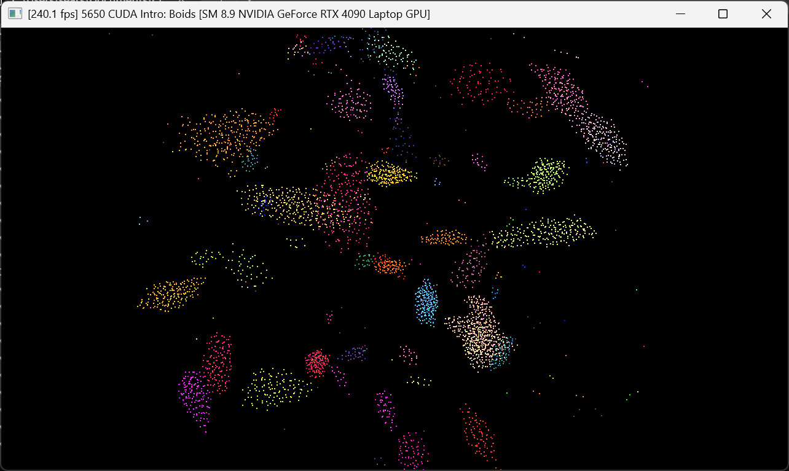
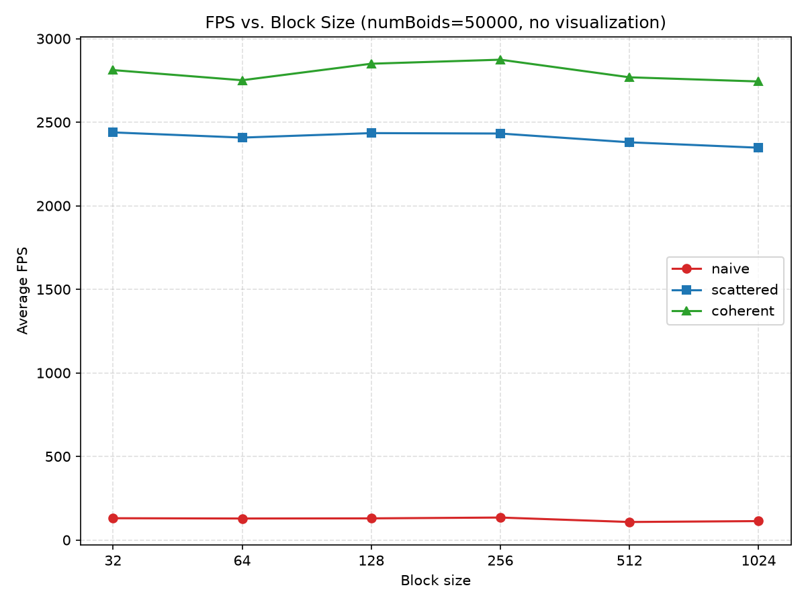
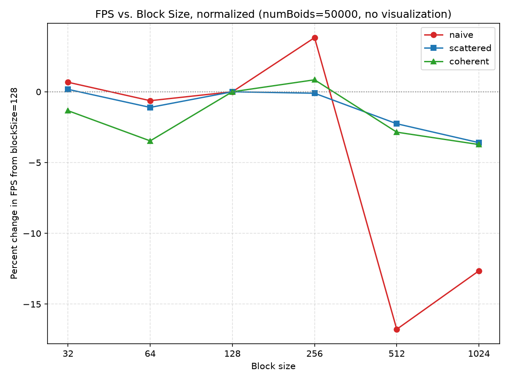
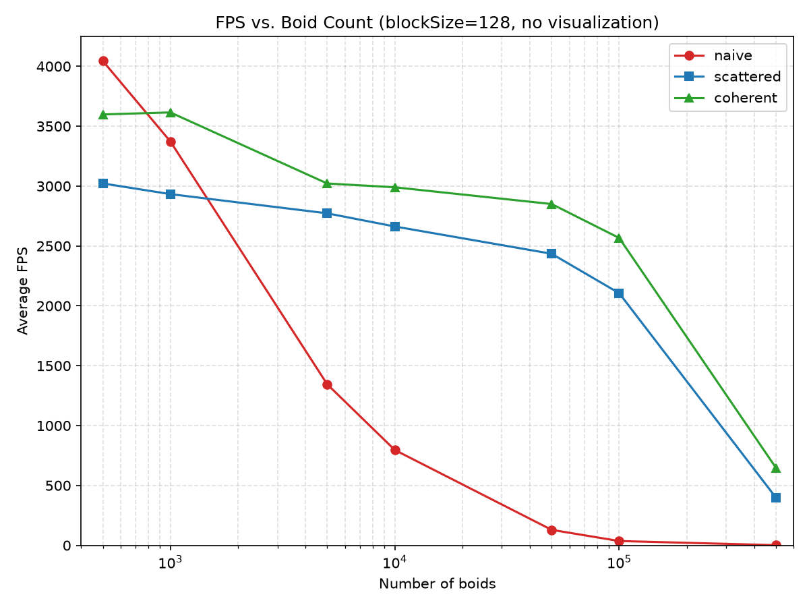
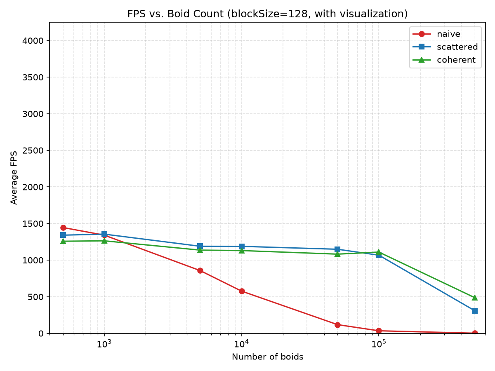
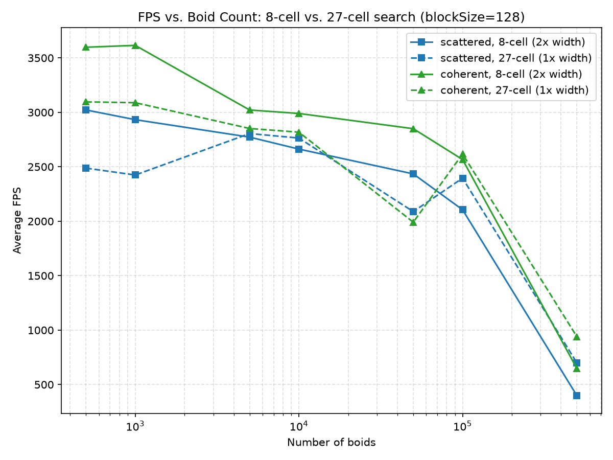

**University of Pennsylvania, CIS 5650: GPU Programming and Architecture,
Project 1 - Flocking**

* Stephen Gavin Sears
  * [LinkedIn](https://www.linkedin.com/in/gavin-sears-536a1b285), [personal website](https://gavin-sears.github.io/sgavinsears/index.html)
* Tested on: Windows 11, i9-14900HX @ 2.20GHz 32GB, RTX 4090 Laptop 16GB, Compute Capability 8.9 (Personal Computer)

## CUDA Boids

.gif)

## Performance per approach

### Methodology

Data collected in release mode with no visualization (except for one chart, labeled below).
V-sync was also disabled for all measurements.

Boid counts tested: 500, 1,000, 5,000, 10,000, 50,000, 100,000, 500,000

Block sizes tested: 32, 64, 128, 256, 512, 1,024 (default 128)
 
The three algorithms were run in the order naive, scattered grid, then coherent grid in an automated benchmarking function that grouped together runs with the same blockSize and uniform grid cell width. 

Each configuration began with a 5-second warm-up period to let the simulation reach a steady state, after which FPS was sampled once per second for 5 seconds and averaged into a single data point.

GPU clock, temperature, and power draw were monitored throughout. During runs with a high number of boids, temperature did rise into the high 60s and reduce clock cycles, but the 5 second warm-up before each round of sampling appeared to be enough for clocks to recover.

### Results

#### FPS vs Block Size

using a linear scale it is hard to see performance differences. If we take the percent difference from block size 128, we can suddenly see that overall, the block size of 256 performed the best, with the only exception being the scattered approach with a block size of 32. Note how for the naive approach, block size mattered a lot more than it did for the other two approaches (more on this in the "Questions" section).

#### FPS vs Boid Count

Naive approach is O(n^2), thus performance degrades exponentially. Scattered and coherent have a more linear appearance, but start performing worse around 100,000, which is likely the point where the GPU is at full capacity for its work. Additionally, note how the versions with visualizations start with a higher starting penalty, but with more boids, eventually reaches the same values as the version without visualization.

#### FPS vs. Cell Width

FPS degrades at mostly the same rate, but we see the 27-cell approaches take a performance hit around 50,000, which is probably due to the grid's index arrays outgrowing the L2 cache at that point, causing more memory accesses to miss the cache and fall back to slower global memory.

### Questions

#### For each implementation, how does changing the number of boids affect performance? Why do you think this is?

In naive, you see an exponential drop in performance. This is because the algorithm is O(n^2) from having to loop through every boid in the scene for each boid. For scattered and coherent, you see a gradual drop, with coherent being slightly above scattered. Both algorithms are O(n) time complexity, so they scale better than naive, but coherent has a lower upfront cost because of the lack of indirection from having an array of boid indices, so it performs a little better than scattered in all cases. Naive briefly outperforms scattered and coherent at low numbers because that algorithm does not require allocating large data arrays, which makes the upfront cost slightly lower.

There is also a larger upfront cost associated with rendering the boids, which is why the visualized chart achieves lower framerates.

#### For each implementation, how does changing the block count and block size affect performance? Why do you think this is?

The scattered and coherent methods have very little per-thread work compared to naive, so we don't see very large performance gains by tuning block size. However, it appears that 256 performs the best for these two approaches. Naive's FPS dropped at 512 block size to more than 15% below its FPS at 128 block size. The naive approach has threads that loop through each boid in the scene. Because there are so many registers being used per thread, an SM can't have as many blocks running at the same time, which lowers occupancy due to lower number of active threads. This causes performance to decrease since the GPU can't hide memory read latency.

#### For the coherent uniform grid: did you experience any performance improvements with the more coherent uniform grid? Was this the outcome you expected? Why or why not?

There were noticable performance improvements. Coherent always performed similarly or better than the scattered version. For example, at N = 500,000 boids, with 128 block size, coherent was around 63% faster (646 vs 397 FPS) than the scattered approach. Because the position and velocity array gets read from in a coherent manner (reads all happen side by side because of sorting), accessing the memory does not cause as harsh of a penalty. I would have expected the coherent approach's performance benefits to grow faster with N, since higher N means more memory reads. However, the gap between the two methods appears almost constant. If I were to do this again, maybe I would try with even higher boid counts to see if the difference grew with higher boid counts.

#### Did changing cell width and checking 27 vs 8 neighboring cells affect performance? Why or why not? Be careful: it is insufficient (and possibly incorrect) to say that 27-cell is slower simply because there are more cells to check!

When the boid count is lower, the 27 cell method has more empty cells, which means we are needlessly checking extra empty cells. When the boid count is very high (around 100,000), this actually helps us, since the higher resolution of cells means the volume we loop through for neighboring boids is actually lower (closer to actual rule radius), which saves FPS. However, somewhere between these two sides (around 50,000), we see a noticable dip in the two 27 cell versions. As we increase the number of boids, we are increasing the size of the arrays that hold grid information. At a certain point, this will become too large for the L2 cache, causing memory accesses to miss the L2 cache and go to global memory, which causes a huge performance hit.